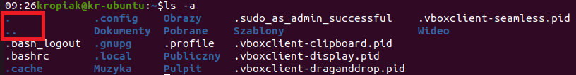

# Lab 3 - an introduction to the BASH shell

Bash is a system shell, that is, a program that mediates between the user and the computer and allows “communication” with the operating system through commands often presenting the results of the action on a standard output - by default, the console window from which the commands were entered. It is one of the most popular shells, created for the [GNU](https://en.wikipedia.org/wiki/GNU) project, and is one of the most popular shells among Unix, Linux systems. It is also available in some versions of macOS.

> The name is an acronym for Bourne-Again Shell (an English play on words: phonetically it sounds the same as born again shell, meaning reborn shell).  
See [Wikipedia](https://en.wikipedia.org/wiki/Bash_(Unix_shell))

## 1. Running BASH shell and basic file system operations

If you want to call up the terminal window from the graphical user interface in Ubuntu, the most convenient way would be to use the keyboard shortcut `Ctrl + Alt + t`. In the case of the 20.04 version downloaded for the class, you can also use the icon in the lower left corner and display programs (frequently used by default) and search for `terminal` at the top. In the case of connecting via SSH terminal (e.g. PuTTy program) if our user has the shell set as bash by default, we just need to log in with our credentials (login, password) and the shell will be started and we can send commands to the system remotely. The process of connecting via SSH will be covered later in the course.

A file system is a collection of directories and files organized as a tree structure. There are some differences in the organization of this structure for different operating systems. File systems in the Windows family of software are divided into lettered volumes, where each volume is a separate structure. The path `C:\Program Files\notepad.exe` and `D:\Program Files\notepad.exe` form a separate structure, where the drive letter is the root of the tree and subsequent folders and files form a hierarchy. On Linux systems, there is only a structure where the root element is the `/` directory which is the parent element for all other file system resources. This does not mean that on Linux systems we can have only one volume or file system. We can connect multiple file systems at the same time, but only one will be the main system and others will be mounted to it, that is, placed in the existing structure.

Example directory structure in the root directory of a Linux system:


The purpose of a few selected file system folders:
* **/bin** - a directory containing the programs necessary to run the system;
* **/dev** - directory containing special files that represent available devices;
* **/etc** - a directory with local system configuration files;
* **/home** - this directory contains the home subdirectories of the system users;
* **/proc** - a virtual file system that provides information about the current processes on the system and its kernel;
* **/root** - customarily the home directory of the `root` user, i.e. the system administrator;
* ** **/usr** - the directory containing the set of application software available to users;
* **/var** - this directory contains files that frequently change their contents and/or size.

A detailed description of the structure is available in the system help `man 7 hier`.

### 1.1 Using built-in system help

On Unix systems, system help is available in the form of text documents describing various aspects of the system and its tools. The documentation can be accessed through an interactive viewer, which is launched with a command:

Help (manual) for a particular system command or issue such as permissions (permissions) can also be accessed through shell commands. This command is of the form:

```console 
man command
```
where command_name is the name of the program or service for which you want help, such as:

```console
man passwd
```
allows you to get help for the `passwd` command. 

The documentation pages are divided into sections that separate the information contained in the help - here is a list of the most popular sections:

`NAME` - name and a brief comment or explanation;  
`SYNOPSIS` - ways to run the program or command along with a list of possible switches;  
`DESCRIPTION` - full description of the program and detailed description of possible switches;  
`CONFIGURATION` - a description of the configuration of the service or program;  
`FILES` - description of configuration files;  
`SEE ALSO` - tips on similar or related commands.  

The entire documentation is divided into disjoint chapters, which may vary depending on the implementation of the system, but the most common division is as follows:

Chapter No. 1 - user commands;  
Chapter No. 2 - system calls;  
Chapter No. 3 - library functions;  
Chapter No. 4 - special files;  
Chapter No. 5 - file formats;  
Chapter No. 6 - games;  
Chapter No. 7 - conversions and manifolds;  
Chapter No. 8 - administration and administrator commands;  
Chapter L - math library functions;  
Chapter N - tcl functions.  

Strony pomocy są oznaczane za pomocą hasła i numeru rozdziału, np.:

`passwd(1)`  
means that for the passwd user command, the system help is located in chapter No. 1. We can invoke the indication of a specific help chapter by the command:

```console
man 1 passwd
```
The help for the `passwd` command from Chapter 1 is displayed.

The system help is displayed using the `more browser`, which is operated with the following keyboard commands:

`space bar` - next page,  
`Ctrl+B` - previous page,  
`q` - close and exit the manual,  
`/` - forward text search, after the `/` sign you type the text to search,  
`?` - search for text backwards,  
`n` - move to the next searched occurrence,  
`N` - move to the previous searched phrase.

If we do not know the name of a specific tool then we can display all help documents that contain the keyword.

```console
kropiak@kr-ubuntu:/$man -k search
apropos (1)          - search the manual page names and descriptions
apt-patterns (7)     - Syntax and semantics of apt search patterns
badblocks (8)        - search a device for bad blocks
bzegrep (1)          - search possibly bzip2 compressed files for a regular expression
bzfgrep (1)          - search possibly bzip2 compressed files for a regular expression
bzgrep (1)           - search possibly bzip2 compressed files for a regular expression
find (1)             - search for files in a directory hierarchy
lzegrep (1)          - search compressed files for a regular expression
lzfgrep (1)          - search compressed files for a regular expression
lzgrep (1)           - search compressed files for a regular expression
manpath (1)          - determine search path for manual pages
tracker-search (1)   - Search for content by type or across all types
xzegrep (1)          - search compressed files for a regular expression
xzfgrep (1)          - search compressed files for a regular expression
xzgrep (1)           - search compressed files for a regular expression
zegrep (1)           - search possibly compressed files for a regular expression
zfgrep (1)           - search possibly compressed files for a regular expression
zgrep (1)            - search possibly compressed files for a regular expression
zipgrep (1)          - search files in a ZIP archive for lines matching a pattern

```


It is also possible to use other system help search commands:
```console
apropos passwd
whatis passwd
info passwd
```

It is also possible to use the help content available online at: [https://manpages.ubuntu.com/manpages/noble/](https://manpages.ubuntu.com/manpages/noble/).


### 1.2 **Basic operations in the file system**

The basic form of the command is as follows:
``console
command [switch/option] [arguments].
```

An example of a command that allows us to display the contents of a selected area of the file system:

```console
ls -l /home
```

The above call will run the `ls` (short for `list`) command with the `-l` option and the `/home` argument. This particular call to the `ls` command will display an expanded version of the view of the contents of the `/home` folder, which contains the home folders of all users except the `root` user.

The resource information that is displayed via the `-l` option is starting from the left:
The first letter indicates the type of resource - `d` - folder (directory), ` -` - means file. There may also be other symbols such as socket.

The next 9 characters are permissions:
- the first 3 from the left are permissions for a user (user, abbreviated `“u”`),
- the next 3 are permissions for group (abbreviated `“g”`),
- the last 3 are permissions for others (others, abbreviated `“o”`).
The letters `rwx` and the `-` sign in the permissions mean:  
`r` - right to read (read),  
`w` - the right to write (write),  
`x` - right to execute (execute) in the case of a file; right to search through in the case of a directory,  
`-` no given right.

The next columns are:
- number of hard links to a given resource,
- owner,
- group,
- size on disk,
- date and time of last modification,
- the name of the resource.  

See also the `dir`, `vdir` commands.


The basic form of the `ls` command without any arguments and options displays the contents of the current folder without including hidden resources. When a user logs in, the current folder is usually his home folder if one has been created. Information about the current folder can be checked with the `pwd` command, which is an acronym for the English phrase `print working directory`.  
The information about the current folder is also found before the prompt.

Let's consider the following example string in the console.

```console
kropiak@kr-ubuntu:~$
```

The string `kropiak@kr-ubuntu` indicates the logged-in user `kropiak` on a machine named `kr-ubuntu`. The `:` character is followed by information about the current working directory, with `~` being a special alias indicating the user's home directory (you can make sure by typing the `pwd` command, which will display the full path). The last character you see here is the command prompt. If the effective UID (user identifier) is 0 then the `#` character, otherwise the `$` character.

The appearance of the entire string before the prompt can be changed and is stored in a system variable called `PS1` (de facto there are also variables PS2, PS3 and PS4, which correspond to the other 3 terminals between which you can switch). To display the value of an already defined variable, we must precede its name with `$`.

To display the value of this variable in the console we will use the `echo` command:

```console
kropiak@kr-ubuntu:~$ echo $PS1
```

The result can be similar to the following string:
```console
\[\e]0;\u@\h: \w\a\]${debian_chroot:+($debian_chroot)}\[\033[01;32m\]\u@\h\[\033[00m\]:\[\033[01;34m\]\w\[\033[00m\]\$
```

It looks quite complicated and mysterious, but every expression it contains has an explanation. I leave it to the reader to learn the details and how to change the information displayed, and he can refer to the article posted [here](https://phoenixnap.com/kb/change-bash-prompt-linux).

The `ls` command contains a number of switches that allow us to achieve different effects when displaying the contents of the file system and their complete list is available in the documentation (`man ls`).

To pass more than one switch with a single command we can do it in several ways:

```console
ls -la
ls -l -a
la -l --all
```

Each of these three commands will have exactly the same effect. In the first case, the mechanism of combining options was used, which means that each option in such a case must be one-letter what can be observed in the second case. However, if the switch/option requires a parameter then combining them is not always possible. This will be demonstrated using the `useradd` command as an example.

```console
useradd -m -s /bin/bash jsmith
```

In this case, the useradd command (we will learn about it later in the lab) takes the `-m` option followed by `-s`, which, however, requires a value and here it is `/bin/bash`. The last value is the `useradd` command argument - jsmith - which is the name of the user being created.

The last example, the `ls -l --all` command is the use of the alternative notation of the short option with the long version, with the characters `--` however, the existence of such an alternative should be confirmed in the documentation. This form of option can also take arguments in the form of `--option=value`. 


The execution of the `ls` command, depending on the selected options, can also display two symbols - `.` and `..`.



These designations are aliases that make it easier to navigate the file system structure and are often used by shell scripts. The symbol `.` denotes the current folder and `..` denotes the parent folder.
This way we don't need to know their exact names to use them in commands.

#### **Navigating through the file system**

To change the current folder to another we use the `cd` (change directory) command, which takes an argument in the form of a path to the folder. This path can be relative or absolute. Relative path means the distance we have to travel from the current folder to the destination folder. E.g.:

```console
kropiak@kr-ubuntu:/$cd etc
```
The above command will change the current folder from `/` to `/etc`. The path is given as a relative path for the reason that it does not contain the full information from the root directory (on Windows systems from the drive letter) to the destination. This means in this case that we will go to the `etc` folder provided it is in the current folder.
To go to the `/etc` folder from anywhere, we must specify an absolute path, which means that no matter what the current folder is, we will be able to change it to the destination folder.

```console
kropiak@kr-ubuntu:/$cd /etc
```
When specifying paths we can use the symbols (aliases) `.` and `..`, e.g. command:

```console
kropiak@kr-ubuntu:/home/kropiak$cd ..
```
will change the current folder to the `/home` folder, i.e. we have made the transition one level up if we treat the file system like an inverted tree, where the root is the parent element. Paths can also be more complex, such as:
```console
kropiak@kr-ubuntu:/home/kropiak$cd ../..
```
will take us two levels higher if possible.

#### **Creating files and directories**

The `mkdir` (make directory) command allows you to create folders and folder structures.

`mkdir [switch] foldername`.  
Ex:
`mkdir ./xyz` - creates xyz folder in the current directory;  
`mkdir ../xyz` - creation of directory xyz in the immediate parent directory.  

Correspondingly, `rmdir` is used to delete folders or their structures.  
`rmdir [switches] directory_name`.  
`rmdir ~/xyz` - remove the xyz directory from the home directory;  
`rmdir ./xyz` - remove the xyz directory from the current directory.

For the rmdir and mkdir commands, there is a `-p` switch that allows you to respectively, delete and create directory structures, such as:

`rmdir -p abc/def/ghi` - will remove the ghi, def and abc directories that formed the hierarchy.

> When using the `-p` option, be careful not to delete unplanned resources.

#### **Copying and moving resources**

A file is a defined (mostly user-defined) portion of data that is stored on the system in storage. On UNIX systems, almost everything is a file, including devices which are represented by special files. This allows, to maintain a consistent way of accessing and handling multiple heterogeneous resources, in one transparent way. File names do not have a split between name and extension, however, this approach can be used. It is possible to use special characters (e.g.: $, % or #) in file names, but this is not recommended.

Basic file handling operations can be performed using the following commands:

`cp [switches] file_name new_name_or_directory` - copy the file specified by the first argument to the name or directory specified by the second argument, e.g.:  
`cp abc.txt xyz.txt` - copies the file abc.txt under the new name xyz.txt in the current directory;  
`cp /tmp/abc.txt ~` - copies the abc.txt file from the /tmp directory to the user's home directory;  
`cp abc.txt ~/xyz.txt` - copies the abc.txt file from the current directory under the new name xyz.txt in the user's home directory.

A useful switch of the `cp` command is the `-r` switch, which is used to copy entire directory structures.

`rm [switches] list_files` - deletes files given as arguments to the call, e.g.:  
`rm abc.txt xyz.txt` - deletes abc.txt and xyz.txt files in the current directory;  
`rm /tmp/abc.txt` - removes the abc.txt file from the /tmp directory;  

A useful switch for the `rm` command is the `-r` switch, which is used to delete entire directory structures.

`mv [switches] file_name new_name` - renames the file specified by the first argument of the call to the name specified by the second argument of the call. If the second argument of the call is a directory, then the file will be moved to that directory, such as:  
`mv abc.txt xyz.txt` - rename the file abc.txt to the name xyz.txt in the current directory;  
`mv /tmp/abc.txt ~` - move the abc.txt file from the /tmp directory to the user's home directory.

`touch [switches] file_name` - modifies information on file modification and reading times, but also allows you to create a file, such as:

`touch abc.txt` - creates an (empty) abc.txt file in the current directory.

Commands for files (and directories) can also be issued using so-called generalization patterns, which are created using the following operators:

`*` - replaces any string of characters (including empty);  
`?` - replaces exactly one arbitrary character;  
`[<characters>]` - replaces exactly one character from the specified range, e.g.: [xyz];  
`[^<characters>]` - the `^` character at the beginning denotes the complement of the set, that is, for example, [^xyz], denotes any character that is not x, y and z.
Here are sample commands using generalization patterns:

`cp ./*.txt ~` - copies all files with the extension .txt from the current directory to the user's home directory;  
`rm ./[0-9]*` - deleting all files from the home directory whose name begins with a digit.

Files can also be created, viewed and edited using editors accessible from the terminal. In addition to the rather unintuitive but iconic `vim` editor, it is worth checking out the capabilities of the simple `nano` editor.

#### **Searching through the file system.**

This task can be accomplished in several ways, depending on the nature of the file being searched for and the search criteria.

Locating executable files - programs - can be done using the command:

`whereis [switches] list_programs`. 

The result of this command is information about the full path to the file and the location of the system help file for the searched program - example:

```console
whereis ls
ls: /bin/ls /usr/share/man/man1/ls.1.gz
```
You can also use the command to search for files:

`locate [switch] pattern`  

This program searches for files, providing a list of files with paths whose names will be matched to the pattern given as an argument to the call. The locate program returns results almost immediately, because the search actually takes place on a previously prepared file database (the entire directory structure is not searched). This database (an index of file names), is usually updated once a day - this means that the result may not take into account changes in the file and directory system that were made after the last update of the index (the update can always be done by the system administrator using the `updatedb` command). The query pattern can be built using generalization operators - in which case you should put the pattern in quotation marks so that it is not expanded by the command interpreter; here are examples of calls to the `locate` command:

```console
locate ls
locate "*l*s"
locate "/usr/share/man/*ls.1.gz"
```


The actual search of the system's directory structure for files (and directories) can be accomplished by using the command:

`find directory criteria`

The first argument of the find command call is the name of the directory from which the search is to start; the second argument concerns the criteria to be used for the search. The search criteria specification is a conjunction of criteria, the most commonly used of which are:

- `name <name>` - items with the given name (generalization operators can also be used) - however, case-sensitive;
- `iname <name>` - items with the specified name (generalization operators can also be used) - not case-sensitive;
- `size <size><unit>` - items with the specified size - the following unit expressions are possible: c - bytes, k - kilobytes, w - double-byte words, no unit means 512-byte blocks; + or - signs can be given before the size, they then mean respectively: items with size larger/ smaller than the specified size;
- `atime <days>` - items on which some operation was performed the specified number of days ago; before the number of days you can specify + or - signs, they then mean respectively: items on which some operation was performed more/less days ago;
- `mtime <days>` - items on which were modified a given number of days ago; before the number of days you can specify + or - signs, they then mean respectively: items on which were modified more/less days ago;
- `ctime <days>` - items whose i-node was modified the given number of days ago; before the number of days, you can specify + or - signs, they then mean respectively: items whose i-node was modified more/less days ago;
- `type <type>` - specify which items are to be found: f - regular files, d - directories, l - symbolic links, c - character devices (unbuffered), b - block devices (buffered), p - FIFO queues;
- `exec <command> [{}] } - executes any command; the command can be executed on found items - then use {} characters as command argument.

Here are examples of how to use the find command:

`find ~ -name abc.txt` - will search for all items with the name abc.txt that are located in the user's home directory (and subdirectories);  

`find ~/temp -name “*.txt”` - will search for all items with a name with the extension .txt, which are located in the temp directory (and its subdirectories, if any) in the user's home directory ;  

`find ~ -iname “*.txt” -type f -size +100k` - will search for all common files in the user's home directory (and its subdirectories) that have a .txt extension - case-insensitive - and a size greater than 100kB;

`find /tmp -type f -atime +2 -exec rm {} \`; -print` - will search for all common files in the /tmp directory (and its subdirectories) on which no operations have been performed in the last 48 hours, and delete all found files; the additional -print switch causes the names of found files to be displayed, despite performing an additional operation on them (here rm).

#### **Other usefull bash commands**

`who` - displays currently logged in users in the system,  
`id` - displays information about the ID of the user and the groups to which the user belongs,  
`cat` - displays the contents of the files given as an input parameter. 

Examples:  
`cat file.txt` - will display the contents of file file.txt,  
`cat file.txt file2.txt` - will display the contents of both files according to the specified order

`tac` - works similarly to `cat`, to be checked independently.  
`wc` - counts lines, words and characters in a file. See the command manual for details.  
`grep` - a tool to search files, strings of characters for the specified pattern.

Examples:  
`grep 'name' file.txt` - searches for the text 'name' in the file file.txt.  
`grep 'name' *.txt` - searches for the text 'name' in all files with extension .txt

In the aforementioned cases, 'name' is an argument, which can be a regular expression that can be defined in a more complex way. 
Here are some possibilities:  
`.` - a period replaces any one character of the text.  
`[abc]` - means inserting any character from among those given - a,b or c  
`[a-z]` - means any character from the range a to z  
`[^]` - set complement e.g..  
`[^aA]` - stands for any character that is not a or A, while.  
`[^a-z]` - means any character different from a to z  
`^` - such a designation will mean 'begins with', e.g.  
`^po` - means begins with the letters `po`.  
`$` - means ends with, e.g. `ski$` - ends with `ski`.  
`\` - interprets the next character literally, e.g., `\.`. looks for a period instead of any character  

The `grep` tool also has several useful options:  
`-i` - the pattern is NOT case-sensitive.  
`-n` - for each file it will also display the line number where the pattern was found  
`-l` - will only display the file names where the pattern was found  
`-v` - pattern negation - will display all lines that do NOT contain the pattern  
`-w` - searches not for a fragment of text, but for an entire word that matches the pattern  
Example:  
`grep -nwv 'hello' sam*` - will display the line number of sam* files that do not contain the word ' hello' inside.  
`head, tail` - commands allow you to display only a selected number of lines of a file from its beginning or end. By default, up to 10 lines are displayed, but this can be changed with a parameter.

Example:  
`head -20 long_file.txt` - will display the first 20 lines of the file

#### Redirecting standard output to a file

Data forwarding is another way of sending the result of a command/command to a file (socket/printer). 

Let's consider the following example:
```console
$ ls > /home/kropiak/list.txt
```
The result of the ls command will be redirected (symbolized by the “>” sign) to the above-mentioned file, i.e. that the list that would be displayed on the console will be saved to a file. If the file does not exist then it will be created provided you have the appropriate permissions. If the file exists then it will be overwritten with the new contents.

To add data to the file we need to replace the “>” character with “>>”, so calling again
```console
$ ls >> /home/kropiak/lista.txt
```
will add the data to the file list.txt.

## **Exercises**


1. Przejdź do folderu domowego i wyświetl całą jego zawartość wraz z informacjami o uprawnieniach.
2. Wyświetl zawartość folderu `/var/log` posortowaną według rozmiaru (w wielkościach bardziej czytelnych dla człowieka – KB, MB itd.) rosnąco.
3. Za pomocą edytora nano zapisz do pliku imie.txt swoje imię.
4. Za pomocą komendy echo zapisz swoje nazwisko do pliku nazwisko.txt.
5. Za pomocą polecenia cat wyświetl zawartość obu plików.
6. Za pomocą polecenia cat dopisz do pliku imie.txt zawartość pliku nazwisko.txt.
7. Zapisz do pliku listę folderów ze swojego folderu domowego.
8. Przy pomocy narzędzia find wyszukaj wszystkie puste pliki w folderach domowych
użytkowników.
9. Przy pomocy narzędzia find wyszukaj wszystkie zwykłe pliki w swoim folderze domowym i zapisz wynik komendy do pliku ~/moje_pliki.txt.
10. Za pomocą find wyszukaj wszystkie pliki, których jesteś właścicielem.
11. Za pomocą find wyszukaj wszystkie pliki w folderze `~`, które zostały zmodyfikowane w ciągu ostatniego dnia.
12. Korzystając z programu find znajdź wszystkie pliki, które posiadają w nazwie słowo mozilla i znajdują się w podkatalogach katalogu /usr.
13. Korzystając z programu find znajdź wszystkie katalogi o nazwie bin, które znajdują się w katalogu /usr.
14. Za pomocą polecenia ls wyświetl tylko pliki z rozszerzeniem txt, które znajdują się w folderze domowym.
15. Wyświetl wszystkie zasoby z folderu /var/log, których nazwa rozpoczyna się od ‘a’ a na 3 pozycji znajduje się litera ‘t’.
16. Wyświetl 20 pierwszych linii pliku z ćwiczenia 9.
17. Wyświetl na konsoli liczbę wyrazów z pliku z zadania 7.
18. Ukryj plik nazwisko.txt korzystając z poznanych poleceń powłoki.
19. Zmień własne hasło.
20. Sprawdź własny identyfikator oraz grupy, do których należysz.
21. Sprawdź kto jest zalogowany w chwili obecnej w systemie.
22. Zapoznaj się z opisem struktury katalogów - polecenie `man 7 hier`. 
23. Wyświetl zawartość katalogu domowego.
24. Wyświetl zawartość podstawowych katalogów w systemie (np. /dev, /etc, /home, /usr).
25. Utwórz katalog kat1 w katalogu domowym.
26. W katalogu kat1 utwórz jednym poleceniem strukturę katalogów kat2/kat3/kat4.
27. Usuń jednym poleceniem całą strukturę katalogów kat3/kat4.
28. Utwórz w katalogu domowym pliki o dowolnych nazwach z rozszerzeniami .txt i .c.
29. Skopiuj jednym poleceniem wszystkie pliki z katalogu domowego z rozszerzeniem .txt do katalogu kat1.
30. Skopiuj jednym poleceniem wszystkie pliki z katalogu domowego z rozszerzeniem .c do katalogu kat2.
31. Skopiuj całą strukturę katalogów kat1 tworząc analogiczną strukturę o nazwie kat1b.
32. Usuń wszystkie plik z katalogu kat1/kat2.
33. Usuń jednym poleceniem całą strukturę katalogów kat1b.
34. Zmień nazwę dowolnego pliku w katalogu kat1.
35. Przenieś katalog kat1/kat2 do katalogu domowego tworząc w ten sposób katalog kat2b.
36. Przy pomocy programu locate znajdź wszystkie pozycje, które posiadają w nazwie słowo mozilla.
37. Przy pomocy programu locate znajdź wszystkie pozycje, które posiadają w nazwie słowo mozilla i znajdują się w podkatalogach katalogu /usr.
38. Skopiuj wszystkie pliki zwykłe o rozmiarze pomiędzy 10 a 100 bajtów z katalogu /usr/bin do katalogu kat1/kat2 (wykorzystaj polecenie find z parametrem -exec).
39. W katalogu domowym utwórz plik o nazwie plik.txt - sprawdź jakie są prawa dostępu do niego.
40. Przejrzyj pomoc systemową dla wszystkich poleceń zaprezentowanych podczas zajęć.

------

1. Navigate to your home folder and display all of its contents along with permissions information.
2. Display the contents of the `/var/log` folder sorted by size (in more human-readable sizes - KB, MB, etc.) in ascending order.
3. Using the `nano` editor, write your name to the file name.txt.
4. using the `echo` command, write your last name to the file last name.txt.
5. Using the cat command, display the contents of both files.
6. Using the cat command, add the contents of the file name.txt to the file name.txt.
7. Write a list of folders from your home folder to the file.
8. Using the find tool, search for all empty files in the home folders of the
users.
9. Using the `find` tool, search for all regular files in your home folder and save the result of the command to the file ~/my_files.txt.
10. Using `find` search all the files you own.
11. Using `find` search for all files in the `~` folder that have been modified in the last day.
12. Using `find`, find all files that have the word 'mozilla' in their name and are located in subdirectories of the `/usr` directory.
13. Using the `find` program, find all directories with the name bin that are located in the `/usr` directory.
14. Using the `ls` command, display only files with the extension txt, which are located in the home folder.
15. Display all resources from the `/var/log` folder whose name begins with 'a' and the letter 't' is in the 3rd position.
16. Display the first 20 lines of the file from exercise 9.
17. Display on the console the number of words from the file from exercise 7.
18. Hide the file name.txt using the shell commands you learned.
19. Change your own password.
20. Check your own ID and the groups to which you belong.
21. Check who is currently logged into the system.
22. Review the description of the directory structure - the `man 7 hier` command. 
23. Display the contents of the home directory.
24. View the contents of the basic directories on the system (e.g. `/dev, /etc, /home, /usr`).
25. Create directory cat1 in the home directory.
26. In the cat1 directory, create the cat2/cat3/cat4 directory structure with one command.
27. Delete the entire cat3/cat4 directory structure with one command.
28. Create arbitrarily named files with .txt and .c extensions in the home directory.
29. Copy all files in the home directory with .txt extensions to the cat1 directory with one command.
30. Copy with one command all files from home directory with .c extension to cat2 directory.
31. Copy the entire directory structure of cat1 creating an analogous structure named cat1b.
32. Delete all files from the cat1/cat2 directory.
33. Delete the entire cat1b directory structure with one command.
34. Rename any file in cat1 directory.
35. Move the cat1/cat2 directory to your home directory thus creating the cat2b directory.
36. Using the locate program, find all items that have the word mozilla in their name.
37. Using the locate program, find all items that have the word mozilla in their names and are located in subdirectories of the /usr directory.
38. copy all regular files between 10 and 100 bytes in size from the /usr/bin directory to the cat1/cat2 directory (use the find command with the -exec parameter).
39. In your home directory, create a file named file.txt - check what the access rights to it are.
40. Review the system help for all the commands presented in class.